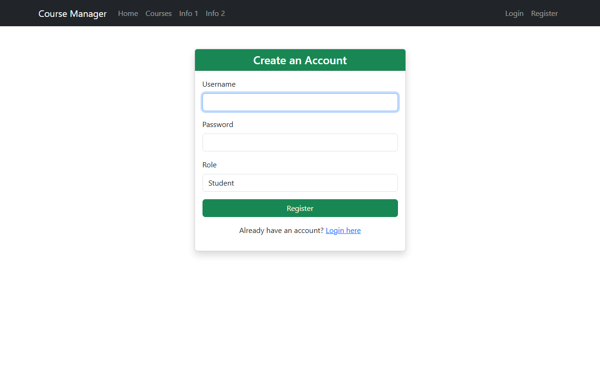
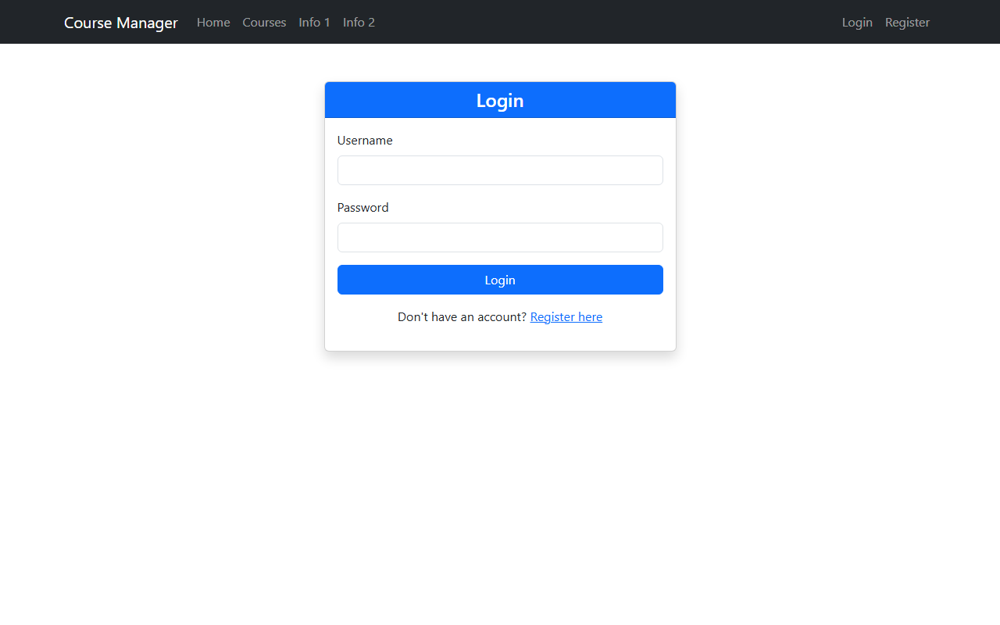
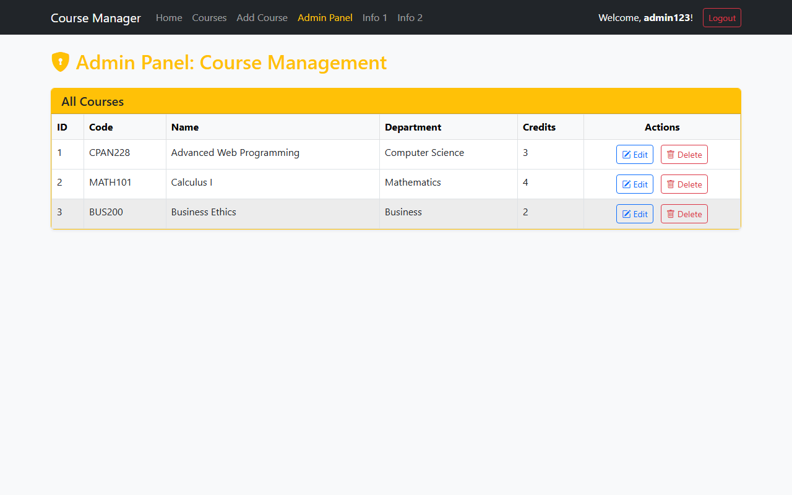
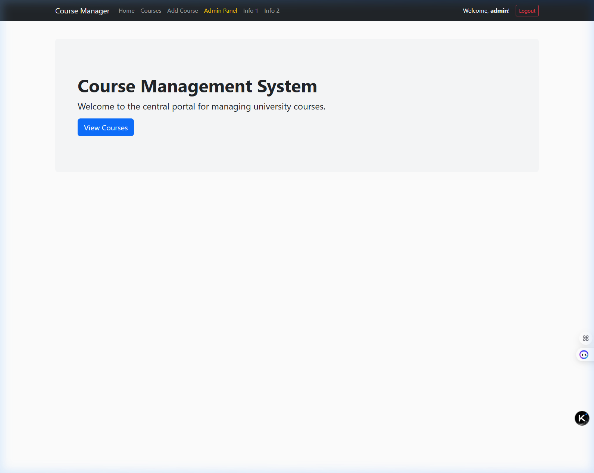
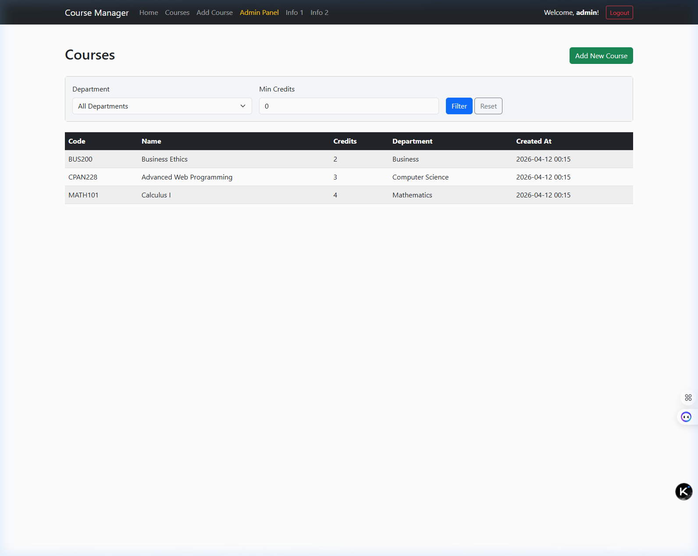
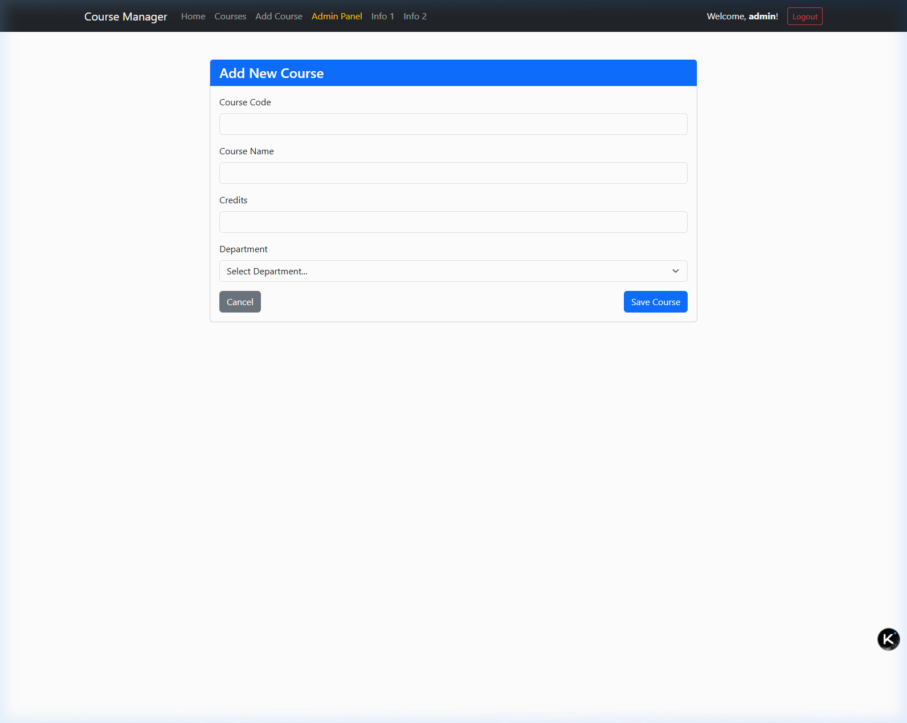
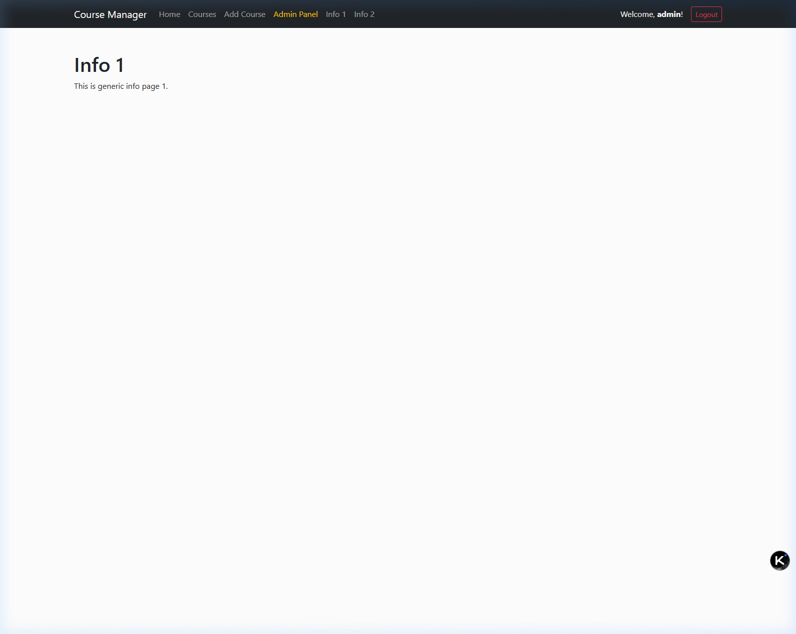

# Course Management System (CMS) - Deliverables 1 & 2
**Course:** Web Application Development - CPAN-228-RNA  
**Team:** Nebil Ferej, Harry Joseph

## Project Breakdown
This project is our Course Management System. For the first phase, we focused on building the core application using Spring Boot, setting up the database connection, and creating the initial user interface with Thymeleaf and Bootstrap. For the second phase, we added a complete security model so users can register, login, and access different parts of the site based on their role.

### Key Features
*   **Database & JPA**: We're using Hibernate and Spring Data JPA to handle data. The `Course` entity stores course details, and the new `User` entity handles accounts. 
*   **Web Interface**: Built with Thymeleaf and Bootstrap 5 so it works on mobile and desktop.
*   **Security layer**: Passwords are encrypted using Bcrypt. 
*   **Role Setup**: 
    - Students can look at courses.
    - Instructors can add new courses.
    - Admins get access to a private dashboard to edit or delete stuff.

---

## Important Phase 2 Code Files
To see how the security and roles were implemented, you can click directly on these main Java files:

*   [`SecurityConfig.java`](src/main/java/com/cpan228/cms/config/SecurityConfig.java) - Has all the route protections, the BCrypt bean, and login/logout rules.
*   [`User.java`](src/main/java/com/cpan228/cms/model/User.java) - The user model that implements Spring's `UserDetails`.
*   [`RegistrationController.java`](src/main/java/com/cpan228/cms/controller/RegistrationController.java) - Handles processing the sign-up form and saving new users securely.
*   [`AdminController.java`](src/main/java/com/cpan228/cms/controller/AdminController.java) - Controls the `/admin` routes so only admins can modify or delete database entries.

---

## Technical Access
*   **URL**: [http://localhost:8081](http://localhost:8081)
*   **H2 Console**: [http://localhost:8081/h2-console](http://localhost:8081/h2-console)
    *   **JDBC URL**: `jdbc:h2:mem:coursedb`
    *   **Login**: `sa` / `password`

---

## Phase 2 Scenarios

### Registration 
Users can create an account. For testing, we left a dropdown to select the role.

### Login
Styled to match the app, shows errors if you type the wrong password.

### Admin Dashboard (Protected Route)
Only visible if you login with an Admin account. Shows the edit and delete options for the database.

---

## Phase 1 Screenshots

### Home Page

### Course List & Filters

### Add New Course

### Info Page

---

## Demo Video

https://youtu.be/tgHMiO67aQY