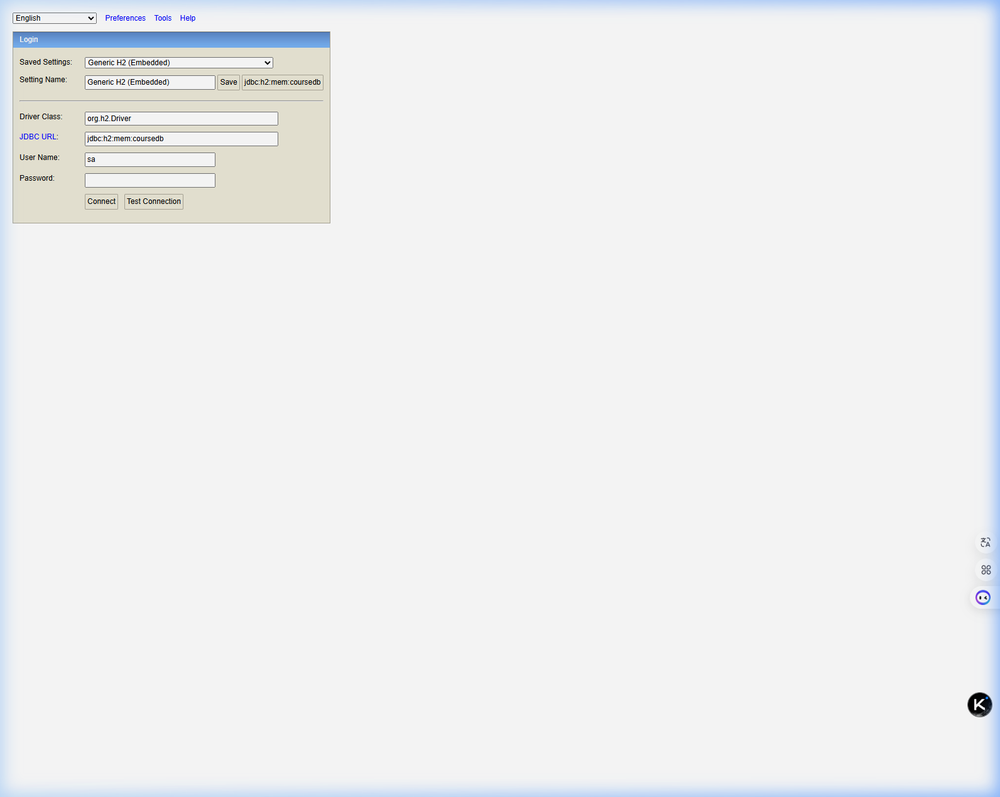

# Course Management System (CMS) - Deliverable 3
**Course:** Web Application Development - CPAN-228-RNA  
**Instructor:** Ly-Christin Mugisha  
**Team:** Nebil Ferej, Harry Joseph

---

## What This Application Does

The Course Management System is a Spring Boot web application for managing academic courses. It supports user registration and login with role-based access control, course browsing and creation, and an admin dashboard for editing and deleting records.

**Roles:**
- Student — can view the course list
- Instructor — can add new courses
- Admin — can edit and delete courses via the admin dashboard

**Profiles:**
- Default (dev) — runs with H2 in-memory database, no setup needed
- QA — runs with MySQL via Docker, for a production-like environment

---

## How to Run with Docker (QA Profile)

This is the recommended way to run the project for review. You only need Git and Docker Desktop installed — no Java or Maven required.

### Requirements

- [Git](https://git-scm.com/downloads)
- [Docker Desktop](https://www.docker.com/products/docker-desktop) — must be open and running before you start
- Ports `8080` and `3307` must be free on your machine

### Step 1 — Open a terminal

- **Windows** — open Git Bash or PowerShell
- **Mac** — open Terminal
- **Linux** — open your system terminal

### Step 2 — Clone the repository

```bash
git clone https://github.com/hjoseph777/Deliverable2-CourseManager-.git
cd Deliverable2-CourseManager-
```

### Step 3 — Start the application

```bash
docker compose up --build -d
```

This builds the app image, pulls MySQL 8, and starts both containers in the background. The first build takes about 2-4 minutes. After that, starting up is instant.

### Step 4 — Check containers are running

```bash
docker compose ps
```

Both containers should show status `Up`:

```
NAME        STATUS           PORTS
cms-db      Up (healthy)     0.0.0.0:3307->3306/tcp
cms-app     Up               0.0.0.0:8080->8080/tcp
```

If `cms-app` shows `Exit` or `Restarting`, wait 30 seconds and run `docker compose ps` again. If it still fails, run `docker compose logs cms-app` to see what went wrong.

### Step 5 — Open the app

Go to **http://localhost:8080** in your browser.

| Page | URL |
|------|-----|
| Home | http://localhost:8080 |
| Course List | http://localhost:8080/courses |
| Login | http://localhost:8080/login |
| Register | http://localhost:8080/register |
| Admin Panel | http://localhost:8080/admin |

To create a test account, go to `/register`, enter a username and password, and select a role from the dropdown. To access the Admin Panel, register with the Admin role, then log in.

### Step 6 — Shut down

```bash
# Stop containers and keep data
docker compose down

# Stop containers and remove all data
docker compose down -v
```

---

## Environment Configuration

Two Spring profiles are configured so no code changes are needed to switch environments.

| Profile | Database | How to activate |
|---------|----------|-----------------|
| `default` | H2 in-memory | Run `mvn spring-boot:run` |
| `qa` | MySQL 8 via Docker | `SPRING_PROFILES_ACTIVE=qa` (set automatically by docker-compose) |

Environment variables used in the QA profile:

| Variable | Value |
|----------|-------|
| `SPRING_PROFILES_ACTIVE` | `qa` |
| `SPRING_DATASOURCE_URL` | `jdbc:mysql://db:3306/coursedb?allowPublicKeyRetrieval=true&useSSL=false` |
| `SPRING_DATASOURCE_USERNAME` | `cmsuser` |
| `SPRING_DATASOURCE_PASSWORD` | `cmspassword` |
| `MYSQL_ROOT_PASSWORD` | `root` |
| `MYSQL_DATABASE` | `coursedb` |

---

## Key Source Files

| File | Description |
|------|-------------|
| [`SecurityConfig.java`](src/main/java/com/cpan228/cms/config/SecurityConfig.java) | Route access rules, BCrypt setup, login/logout config |
| [`User.java`](src/main/java/com/cpan228/cms/model/User.java) | User model, implements Spring UserDetails |
| [`RegistrationController.java`](src/main/java/com/cpan228/cms/controller/RegistrationController.java) | Handles registration form and saves new users |
| [`AdminController.java`](src/main/java/com/cpan228/cms/controller/AdminController.java) | Admin-only routes for editing and deleting courses |
| [`CourseController.java`](src/main/java/com/cpan228/cms/controller/CourseController.java) | Course listing, filtering, and creation |
| [`application.properties`](src/main/resources/application.properties) | Default H2 dev configuration |
| [`application-qa.properties`](src/main/resources/application-qa.properties) | QA MySQL configuration |
| [`Dockerfile`](Dockerfile) | Builds the Spring Boot app image |
| [`docker-compose.yml`](docker-compose.yml) | Starts the app and MySQL containers |

---

## Screenshots

### H2 Database Console (Dev Profile)
JDBC URL: `jdbc:h2:mem:coursedb` — username: `sa` — no password needed  


### Registration


### Login


### Admin Panel


### Home Page


### Course List


### Add Course


### Info Page


---

## Team Contributions

| Team Member | Contributions |
|-------------|--------------|
| Harry Joseph | Spring Boot setup, JPA/database layer, security config, Docker integration, QA profile, admin dashboard |
| Nebil Ferej | Thymeleaf templates, Bootstrap UI, registration flow, course listing and filtering, bug fixes |

---

## Demo Video

Coming soon — will be added after recording the final walkthrough for Deliverable 3.
